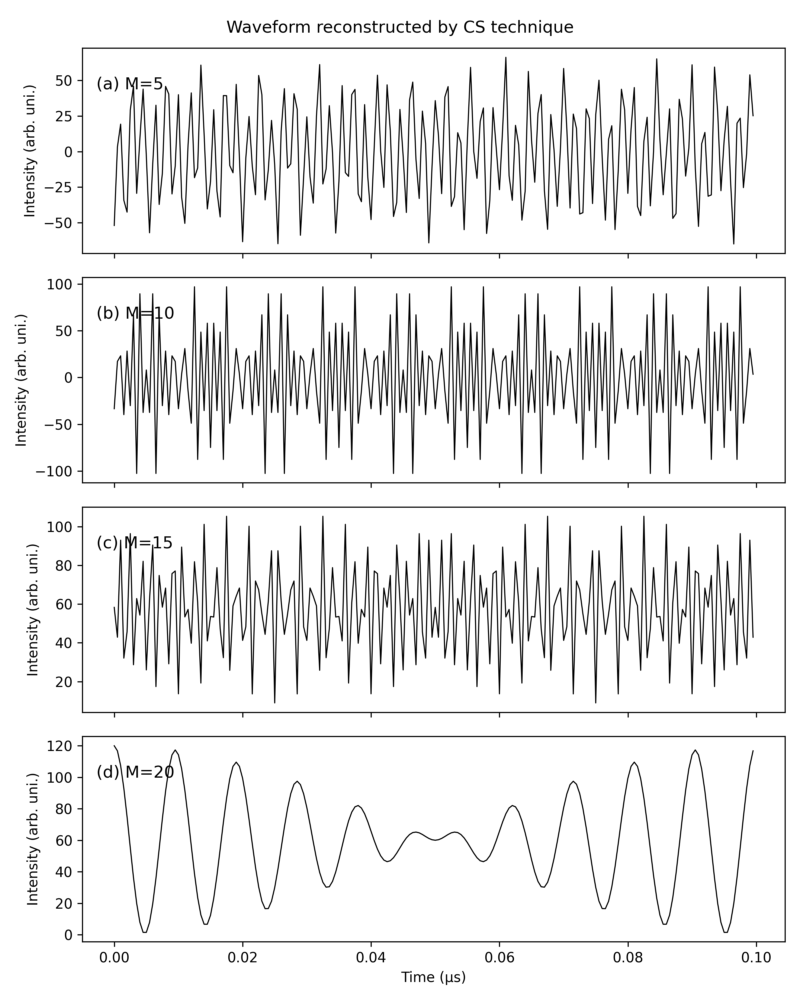
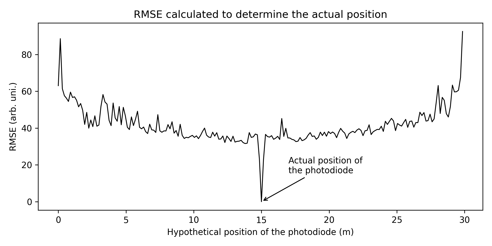
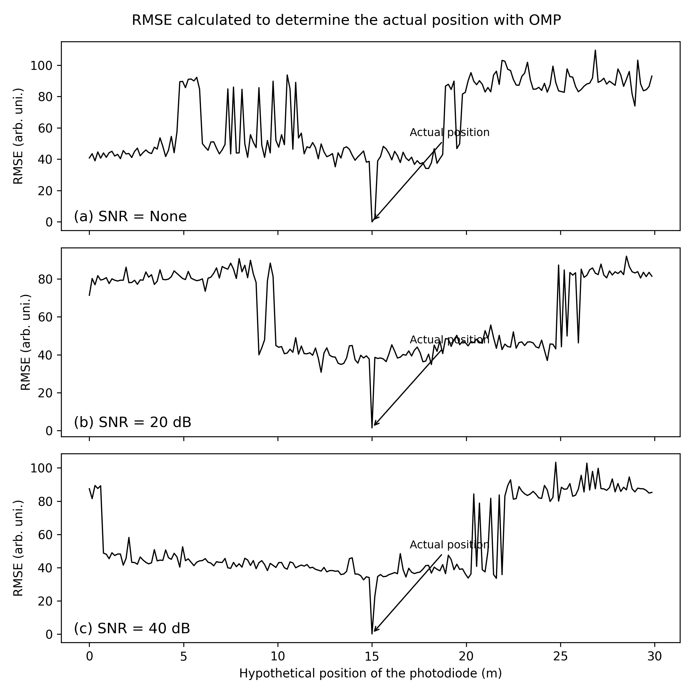
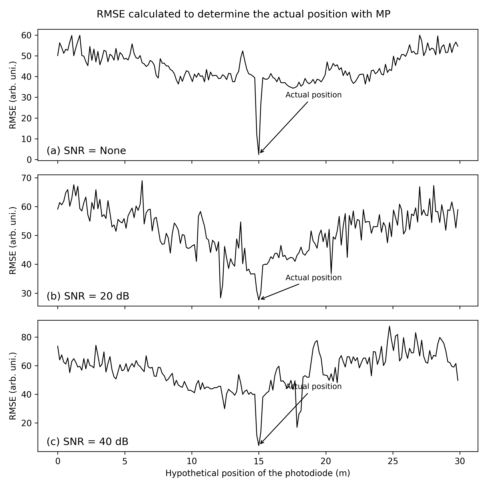

# CS Simulation - Compressed Sensing Ranging

Dự án mô phỏng hệ thống đo khoảng cách sử dụng **Compressed Sensing** và các thuật toán khôi phục tín hiệu:

- Matching Pursuit (MP)
- Orthogonal Matching Pursuit (OMP)

Dự án được xây dựng nhằm:

- Mô phỏng hệ thống đo khoảng cách
- So sánh hiệu năng MP và OMP
- Đánh giá sai số RMSE
- Sinh dữ liệu phục vụ triển khai trên FPGA

---

# 1. Tổng quan hệ thống

Hệ thống sử dụng tín hiệu ngẫu nhiên để đo khoảng cách và áp dụng Compressed Sensing để giảm số lượng mẫu cần thu.

Quy trình gồm các bước:

1. Sinh tín hiệu ngẫu nhiên
2. Tín hiệu phản xạ từ vật
3. Lấy mẫu nén
4. Khôi phục tín hiệu
5. Tính sai số RMSE

---

# 2. Cấu trúc project
```
CS_Simulation
│
├── simulate
│ ├── config.py
│ ├── measurement.py
│ ├── reconstruction.py
│ ├── evaluation.py
│ ├── mp.py
│
├── fpga
| ├── data
| │ ├── po.mem
| │ ├── theta.mem
│ ├── gen_mp_data.py
│ ├── gen_mem.py
│
├── statistic
│ ├── Results.md
│ ├── MP_stats.md
│
├── figure
│ ├── RMSE.png
│ ├── RMSE_SNR_MP.png
│ ├── RMSE_SNR_OMP.png
│ ├── Reconstruct.png
│ ├── Waveforms.png
│
├── main.py
├── test_mp.py
├── test_snr_mp.py
└── test_snr_omp.py
```
---

# 3. Thuật toán sử dụng

## Matching Pursuit (MP)

Thuật toán greedy lựa chọn atom phù hợp nhất với phần dư của tín hiệu tại mỗi vòng lặp.

Ưu điểm:
- Cấu trúc đơn giản
- Dễ triển khai phần cứng

Nhược điểm:
- Sai số lớn hơn OMP

---

## Orthogonal Matching Pursuit (OMP)

Phiên bản cải tiến của MP.

Khác biệt:
- Sau mỗi vòng lặp sẽ thực hiện phép chiếu trực giao
- Giảm sai số khôi phục

---

# 4. Kết quả mô phỏng

## Khôi phục tín hiệu



---

## So sánh RMSE



---

## RMSE theo SNR




---

# 5. Chạy mô phỏng

## Chạy toàn bộ mô phỏng:

python main.py

## Chạy test riêng:

python test_mp.py

python test_snr_mp.py

python test_snr_mp.py

---

# 6. Tác giả

Đặng Hoàng Nam
